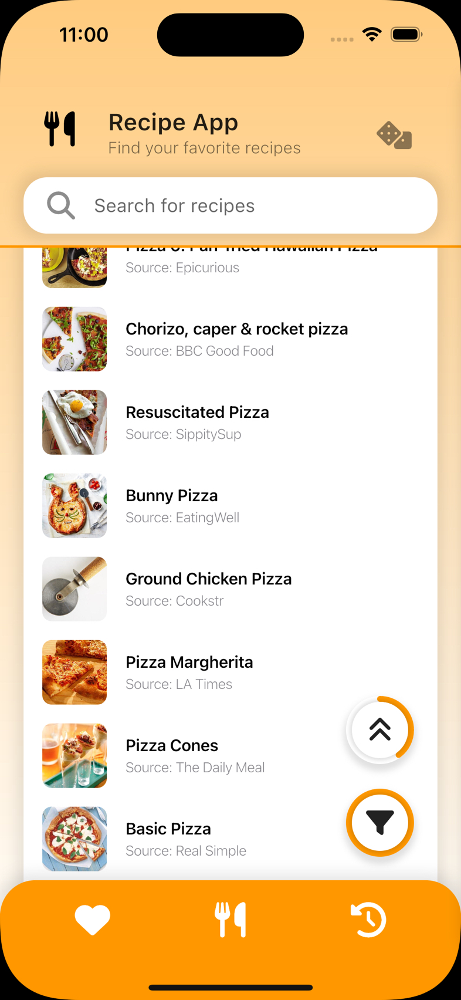
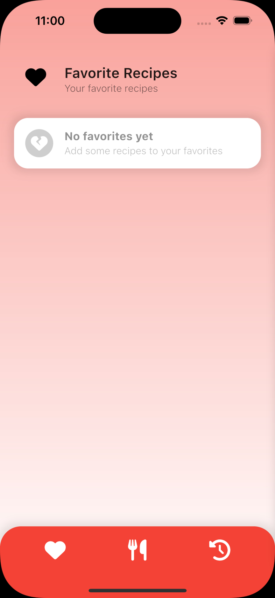
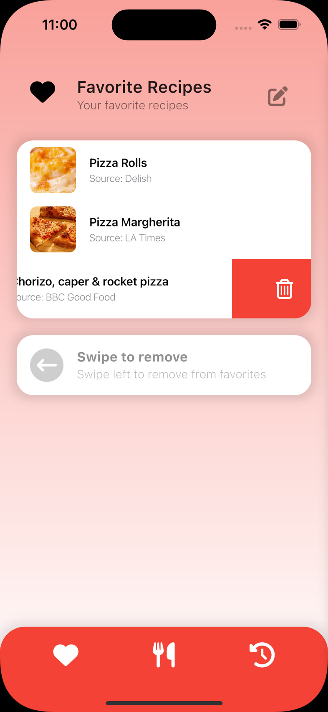

| <h1>Recipe App</h1> | Demo |
|------|---------------------|
| 
This is a recipe search app developed using <code>Flutter</code> and <code>Dart</code>, which utilizes the <code>Edamam Recipe Search API</code>. This project is a case study provided by Ollang, and is currently under development.
<h2>Features</h2><h3>The app has the following features:</h3><ul><li>A main screen where users can search for recipes</li><li>Recipe search results are displayed on this screen</li><li>Users can click on a recipe to view its details</li><li>On the recipe detail screen, users can add the recipe to their favorites</li><li>Users can view their favorite recipes on a separate screen</li><li>Users can remove recipes from their favorites by swiping left or clicking on an edit button</li><li>Users can view their search history on a separate screen</li><li>Users can delete search history by swiping left or clicking on an edit button</li></ul>
State management in this project is implemented using the <code>Provider</code> package, and Flutter Navigation solution is used for page transitions.
 | |

**Development in Progress**

#### The following improvements are planned for the project:

- Implement the `Hive` package as a database solution
- Complete the recipe detail screen
- Implement filtering for search results
- Add a feature to retrieve random recipes
- Implement recipe sharing feature

### Usage

To use the app, simply download the code and run it using the Flutter framework. More detailed instructions for running the app will be provided as development progresses.

Please note that this project is still under development and may not be fully functional.

## Screenshots
| Screenshot 1           | Screenshot 2           |
|------------------------|------------------------|
|  |  |

| Screenshot 3           | Screenshot 4           |
|------------------------|------------------------|
|  |  |
